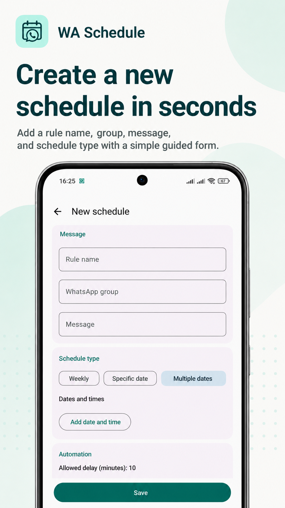
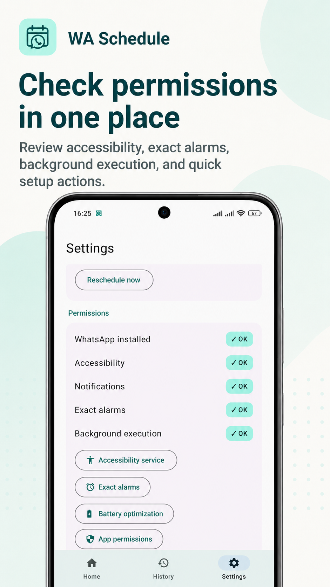
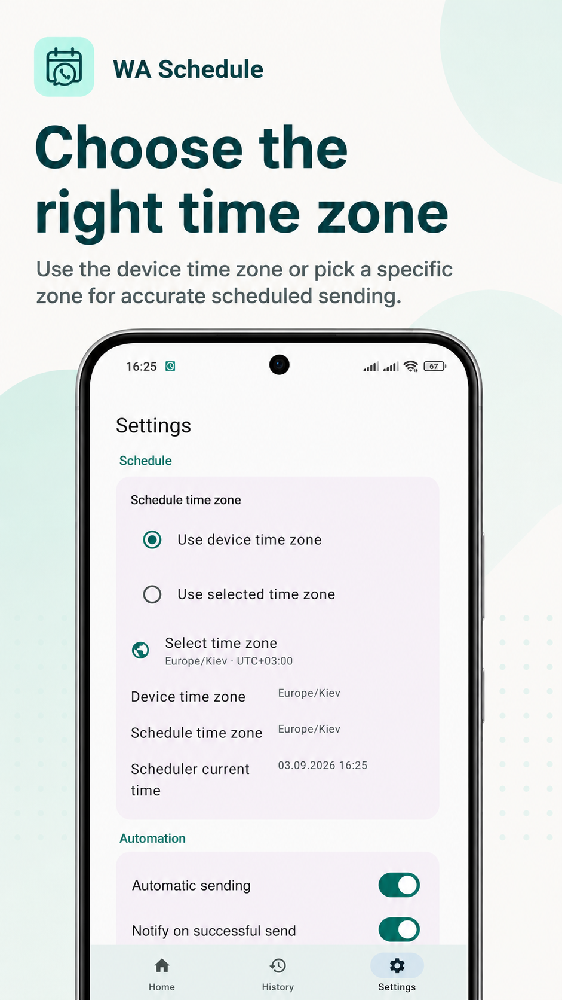
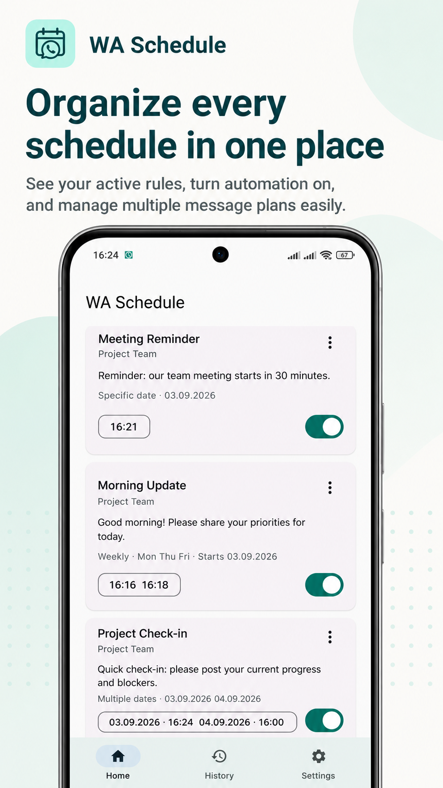
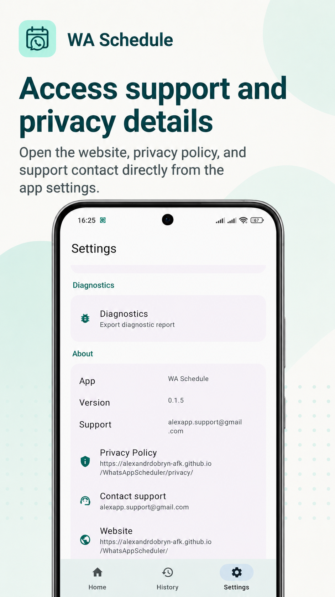
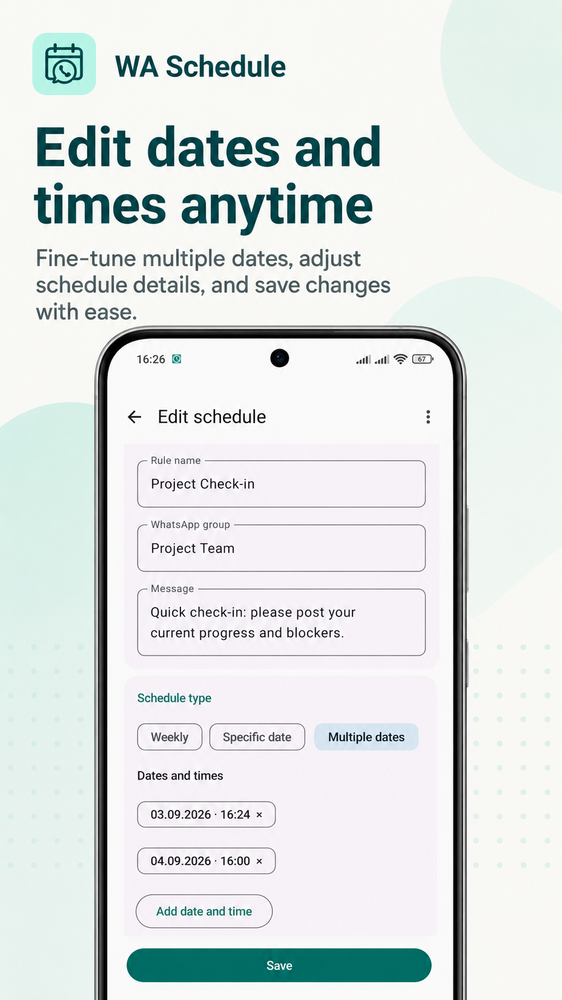

# WA Schedule

**Schedule WhatsApp messages automatically on Android using your personal WhatsApp account.**

WA Schedule is an open-source Android WhatsApp scheduler for personal accounts.
Set a chat or group, message text, weekly days or concrete dates, and exact
send times.
The app runs locally on your phone and uses Android AccessibilityService to
interact with the official WhatsApp application.

**No WhatsApp Business API · No server · No root · Local-first**

[Download latest APK](https://github.com/alexandrdobryn-afk/WhatsAppScheduler/releases/latest/download/app-release.apk)

Privacy Policy:

[https://alexandrdobryn-afk.github.io/WhatsAppScheduler/privacy/](https://alexandrdobryn-afk.github.io/WhatsAppScheduler/privacy/)

Support:

[alexapp.support@gmail.com](mailto:alexapp.support@gmail.com)

Current Android package name:

```text
io.github.alexandrdobryn.waschedule
```

## Test Status

Tested on:

| Area | Status |
|---|---|
| Android Emulator | Not tested in the current compliance run |
| APK installation | Not tested in the current compliance run |
| Accessibility onboarding | Build-verified; runtime not tested in the current compliance run |
| WhatsApp installation and login | Not tested in the current compliance run |
| Rule editor | Under active testing |
| Scheduled end-to-end send | Not fully validated |

Build verification in this repository:

| Check | Status |
|---|---|
| `:app:assembleDebug` | Passed |
| `:app:assembleRelease` | Passed |
| `:app:testDebugUnitTest` | 45 passed, 0 failed, 0 skipped |
| `:app:lintDebug` | Passed, 0 errors, 58 warnings |
| Release APK signature | Verified with `apksigner` |
| Release AAB signature | Verified with `jarsigner` |

## Screenshots

Public screenshots for the current WA Schedule UI:

| Create schedule | Permissions | Time zone |
|---|---|---|
|  |  |  |

| Home | Support and privacy | Edit dates and times |
|---|---|---|
|  |  |  |

## Features

- Schedule WhatsApp messages for personal WhatsApp accounts.
- Send to a configured WhatsApp chat or group.
- Choose weekly days, one specific date with one or more times, or multiple
  date/time pairs.
- Run locally on Android with no backend server.
- Uses Android `AccessibilityService` to operate the official WhatsApp UI.
- Stores only user-created rules and execution history in a local Room database.
- Supports English, Ukrainian, and Russian interface text.
- Includes diagnostics for WhatsApp, Accessibility, notifications, exact alarms,
  battery restrictions, scheduler time zone, and last execution status.

## Install

1. Open the APK link on the Android phone:
   [download/app-release.apk](https://github.com/alexandrdobryn-afk/WhatsAppScheduler/releases/latest/download/app-release.apk).
2. Android will ask whether to allow installing unknown apps from the browser or
   file manager you used. Allow it for that source.
3. Install WA Schedule.
4. Open the app and complete onboarding.
5. Go to Android Settings -> Accessibility -> Installed apps and enable
   `WA Schedule - automation`.

Current APK SHA-256:

```text
24c26f4fe1391c5e54622673b4f6200df23d610cea071741517649117dd08197
```

Do not use `app-debug.apk` for normal installation. Use the signed release APK.
Future updates must be signed with the same private keystore.

## Permissions

| Permission | Why it is needed |
|---|---|
| Accessibility Service | Required to interact with the official WhatsApp UI because personal WhatsApp has no public send-message API |
| Notifications | Shows send success/failure status |
| Exact alarms (`SCHEDULE_EXACT_ALARM`) | Runs schedules at configured exact times after user grants Alarms & reminders access |
| Boot completed | Restores scheduled alarms after reboot or app update |
| Wake lock / foreground service | Helps complete scheduled work reliably |
| Battery optimization exemption | Optional but recommended on aggressive OEM Android builds |

The app does not request `INTERNET`.

## Privacy And Security

- No server.
- No WhatsApp Business API.
- No root.
- No telemetry.
- No `INTERNET` permission.
- The Accessibility service is restricted to `com.whatsapp`.
- The app does not store other people's WhatsApp messages.
- Release builds use R8, resource shrinking, and a local signing key.
- Internal receivers and services are not exported unless Android requires it.

## Usage

1. Open WA Schedule.
2. Tap Add schedule.
3. Enter the WhatsApp chat or group name exactly as it appears in WhatsApp.
4. Enter the message text.
5. Select the start date.
6. For weekly and specific-date rules, add one or more send times.
7. For multiple-date rules, add each date/time pair.
8. Select weekdays for weekly rules.
9. Save the rule.

For manual validation, use Dry Run before sending. Dry Run opens WhatsApp,
searches the chat, verifies the input field and send button, then stops before
tapping Send.

## Limitations

- Personal WhatsApp has no official public API for scheduled sending. WA Schedule
  uses Android Accessibility automation, so WhatsApp UI changes can require app
  updates.
- The app can confirm that it tapped Send in the WhatsApp UI, but it cannot
  guarantee server delivery, recipient receipt, or read status.
- If multiple chats have the same name, the app treats the target as ambiguous
  and does not send.
- Locked devices and aggressive OEM background restrictions can prevent scheduled
  work from running.
- Automated WhatsApp UI use may conflict with WhatsApp terms or app-store
  policies. Use responsibly for personal/local automation.
- Google Play distribution requires accurate Accessibility declaration,
  completed Play Console forms, and real runtime validation.

## Search Terms

WA Schedule can also be described as:

- WhatsApp message scheduler for Android
- Schedule WhatsApp messages
- Automatic WhatsApp group messages
- WhatsApp scheduled sender
- WhatsApp automation for personal account
- Android WhatsApp scheduler
- Scheduled WhatsApp group messages
- Personal WhatsApp scheduling app
- Android scheduled message sender

## Русский

WA Schedule — локальный Android-планировщик для автоматической отправки заранее
подготовленных сообщений в WhatsApp от имени владельца телефона.

Приложение не использует сервер, WhatsApp Business API или root. Оно хранит
только созданные пользователем правила и использует Android AccessibilityService
для взаимодействия с официальным приложением WhatsApp.

## For Developers

- Android Gradle Plugin: 8.5.2
- Kotlin: 1.9.24
- JDK: 17
- minSdk: 31
- targetSdk / compileSdk: 36
- UI: Jetpack Compose
- DI: Hilt
- Storage: Room + DataStore
- Scheduling: AlarmManager + WorkManager

Build:

```powershell
.\gradlew.bat :app:assembleDebug
.\gradlew.bat :app:assembleRelease
.\gradlew.bat :app:testDebugUnitTest
.\gradlew.bat :app:lintDebug
.\gradlew.bat :app:lintRelease
```

Architecture details are in [docs/ARCHITECTURE.md](docs/ARCHITECTURE.md).
The product-release checklist is in
[docs/PRODUCT_RELEASE_SPEC.md](docs/PRODUCT_RELEASE_SPEC.md).
Privacy details are in [PRIVACY.md](PRIVACY.md).
Private release signing details are in [RELEASE.md](RELEASE.md).
